<h1 align="left">❤Hi 👋  I'm Here!❤</h1>

<p align="center">
  <samp>
    <a href="https://lonewolfyx.vercel.app/">me</a> .
    <a href="https://lonewolfyx.vercel.app/blogs">blog</a> .
    <a href="https://lonewolfyx.vercel.app/projects">projects</a> .
    <a href="https://ifdian.net/a/lonewolfyx">ifdian</a>
  </samp>
</p>

<p align="center">
  <samp>
    
    
  </samp>
</p>

```zsh
$ whoami
lonewolfyx · Design Engineer · Open Source Contributor

$ echo stack
> Frontend  :: JavaScript, TypeScript, Vue.js, React, Nuxt, TailwindCSS
> Backend   :: Node.js, NestJS, Python, PHP
> Runtime   :: Bun, Pnpm, Node
> Tooling   :: Vite, Rolldown, Tsup, TsDown, Turbo
> Database  :: PostgreSQL, MySQL, Redis
```

> know more about the front-end tool can read [FE Stack](https://fe-stack.vercel.app/)

or see more:

```bash
npx lonewolfyx
```

<div align="center">
    
</div>

<div>
    <details>
        <summary>More info</summary>
        <div align="center">
            
            
            
        </div>
        <div align="center">
            
        </div>
    </details>
</div>

#### 📊 Weekly development breakdown

<!--START_SECTION:waka-->

```txt
TypeScript                    11 hrs 51 mins        ███████████▒░░░░░░░░░░░░░   45.62 %
Vue                           5 hrs 5 mins          █████░░░░░░░░░░░░░░░░░░░░   19.56 %
YAML                          4 hrs 21 mins         ████▒░░░░░░░░░░░░░░░░░░░░   16.77 %
JSON                          2 hrs 17 mins         ██▒░░░░░░░░░░░░░░░░░░░░░░   08.79 %
Markdown                      1 hr 22 mins          █▒░░░░░░░░░░░░░░░░░░░░░░░   05.31 %
```

<!--END_SECTION:waka-->
